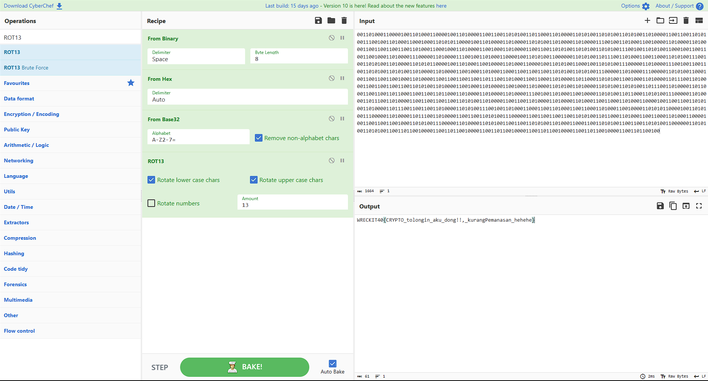
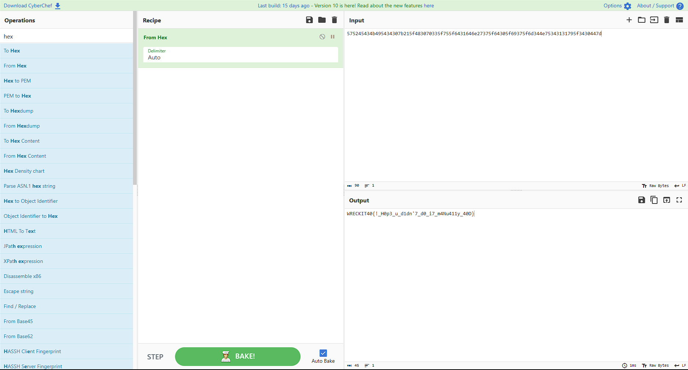
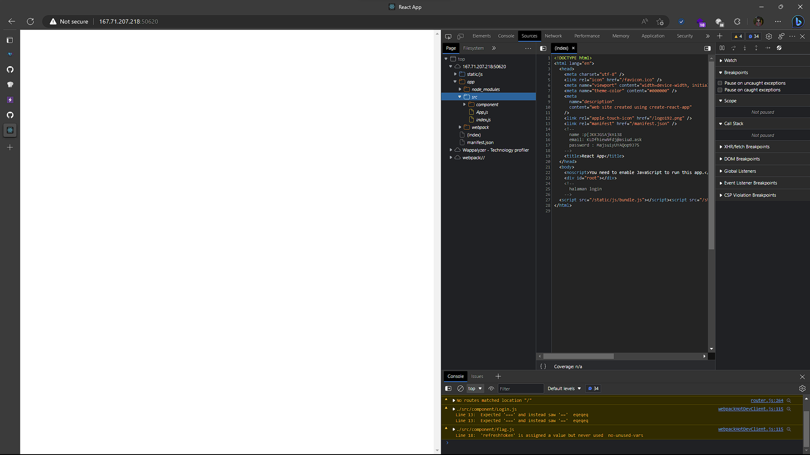
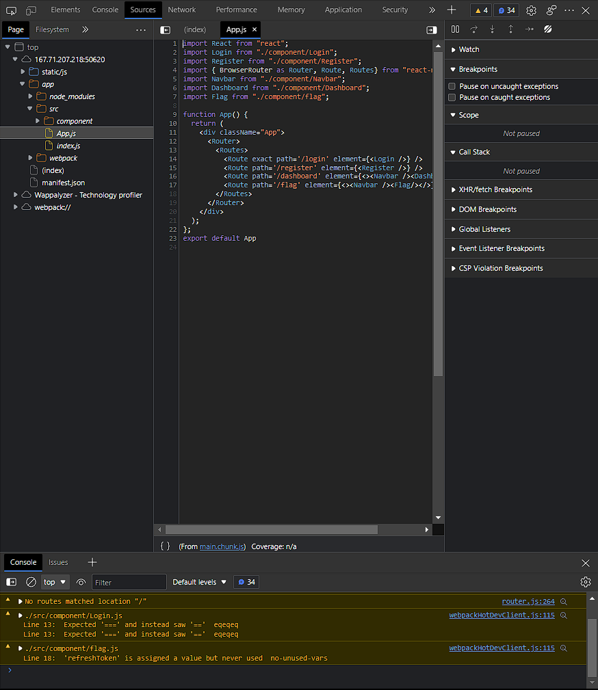
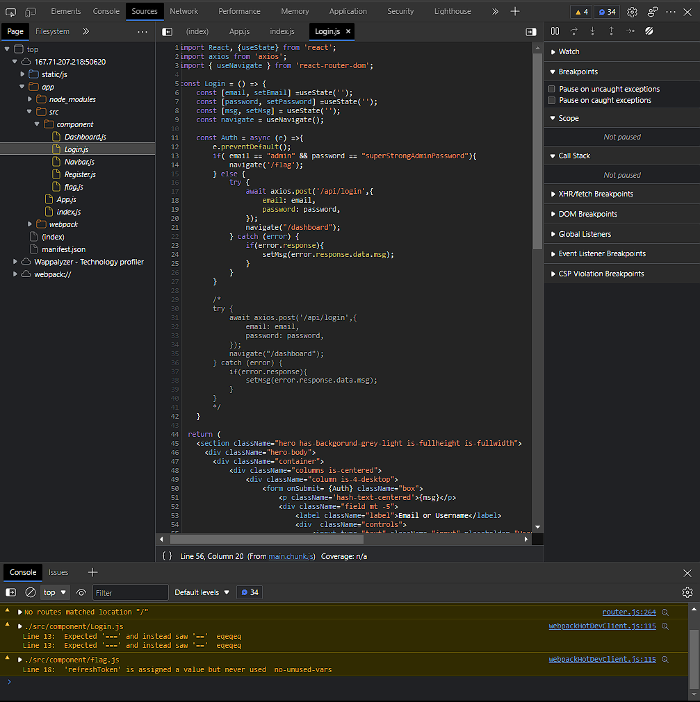
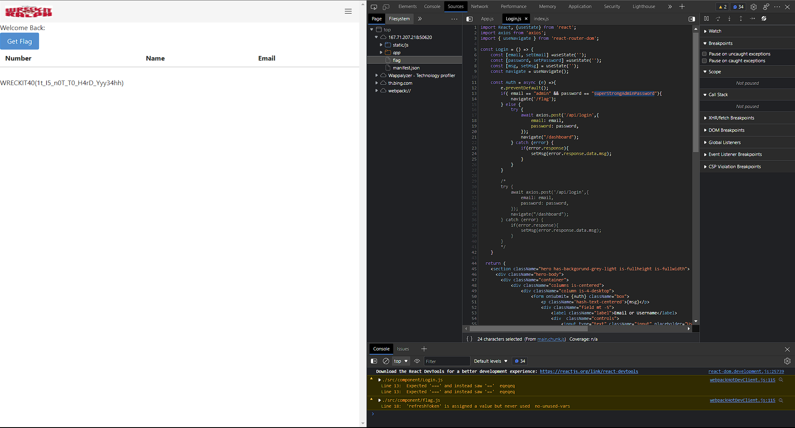

# Writeup WreckIT 4.0 - The Mengkodingkan

## 1. Crypto Free Flag 
### About:
**Category: Crypto**
**Author: ayana_@Jhy**

### Description:
Seorang NPC pergi ke Lawang Sewu dan mendapati suatu pintu dengan tulisan seperti password. Ada palang bertuliskan Bi UNTUK BINERRRRR!!! password is BiHB32R13 

**File: [soal.secret](./files/soal.secret)**
**Content:**
```
00110100011000010011010001100001001101000011001100110101001101100011010000110101001101010011010100110100001100110011010100111001001101000110001000110101011000010011010000110100001101010011010000110100001110010011010001100100001101000011010000110011001100110011010001100010001101000011001000110100001100110011010100110101001101010011100100110101001100010011001100110010001101000011100000110100001110010011010001100001001101010011000000110101001101110011010001100110001101010011100100110101001101000011010101100001001101000110010000110100011000010011010100110001001101010011100000110100001110010011001100110101001101010011010000110100001100100011010001100011001100110011010100110101001110000011010000111000001101010011000100110011001100100011010000110011001100110011011100110100011001100011010000110110001101010011001000110100001101110011010000110011001100110011010100110100001100100011010000110010001101000011010100110100001101010011010100110111001101000011011000110011001101100011001100110110001101000011010000110100001110010011010001100100001101010011011000110101001110000011010000110111001101000011001100110011001101010011010000110011001101000011010000110100011001100011010001100001001100110011010100110100001101110011001100110100001101010011100100110100011000110011010001100110001101000110010000110101011000010011010100111000001101000011011100110100001100110011010100111000001100110011001100110101001101100011010001100110001101000110000100110011001100100011010100111000001101000011010100110011001101010011010001100011001101010011001100110101001100000011010100110101001100110110010000110011011001000011001101100100001100110110010000110011011001000011001101100100
```

### Solution:
Dari deskripsi soal, kita mengetahui bahwa terdapat clue dalam teks `BiHB32R13`. Dari clue tersebut,
`Bi = Binary`, `H = Hex`, `B32 = Base32`, `R13 = ROT13`. Dengan menggunakan tool online seperti cyberchef, kita dapat mendapatkan flag dengan contoh seperti digambar berikut:


### Flag:
**WRECKIT40{CRYPTO_tolongin_aku_dong!!,_kurangPemanasan_hehehe}**

## 2. Rabbithole
### About:
**Category: Misc**
*Author: AOD**

### Description:
Anda tau Matryoshka Doll? kali ini aku gembok dengan sandi yang sangat secure!
**File: [1000.zip](./files/1000.zip)**

### Solution
dalam file **1000.zip** terdapat file yang bersub zip yang membutuhkan password, perkiraan akar file zip tersebut sampai dengan **1.zip**, maka dari itu perlu menggunakan script untuk mempermudah mendapatkan flag yang diperkirakan flag tersebut berada di file **1.zip**

*Note: karna file 1000.zip tidak ada password, sebaiknya diextract terlebih dahulu agar proses extract otomatis akan dimulai dari 999*
```py
# File: bruteunzip.py

import zipfile as zip
import os

for i in range(999, 0, -1):
    try:
        archive = zip.ZipFile(f'{i}_password.zip', 'r')
        with open (f'pw{i}.txt', 'r') as f:
            passwd = f.readlines()
            # open zip
            archive.extractall(pwd=passwd[0].encode('utf-8'))
            # extract zip
            archive2 = zip.ZipFile(f'{i}.zip', 'r')
            archive2.extractall(pwd=passwd[0].encode('utf-8'))
                
            # delete zip
            os.remove(f'{i}.zip')
            os.remove(f'{i}_password.zip')
            os.remove(f'pw{i}.txt')
    except:
        print(f'Password {i} is wrong')
```

Setelah melakukan proses diatas, maka akan muncul file `flag.txt` yang berisi:
```
575245434b495434307b215f483070335f755f6431646e27375f64305f69375f6d344e75343131795f3430447d
```

Terlihat bahwa hash tersebut adalah berasal dari hexadecimal, kamu dapat mengubah menggunakan cyberchef untuk mengubah ke dalam text seperti gambar dibawah ini:



### Flag:
**WRECKIT40{!_H0p3_u_d1dn'7_d0_i7_m4Nu411y_40D}**

## 3. Welcome
No Clue

### Flag:
**WRECKIT40{!_H0p3_u_d1dn'7_d0_i7_m4Nu411y_40D}**

## 4. Rev Free Flag
### About:
**Category: Reverse Engineering**
**Author: ayana_@Jhy**

### Description:
anggep aja flag gratis bang. kasian banyak yang blom pernah nyentuh ctfd keknya
**File: [chall.c](./files/chall.c)**
**Content:**
```c
#include <stdio.h>
#include <string.h>

int main(int argc, char **argv)
{
    int c[] = {119, 74, 101, 91, 107, 81, 116, 44, 16, 99, 20, 107, 76, 41, 127, 122, 20, 118, 71, 71, 80, 125, 82, 117, 17, 118, 84, 44, 20, 118, 127, 44, 84, 44, 83, 44, 78, 71, 78, 43, 87, 122, 73, 43, 127, 126, 82, 113, 69, 118, 68, 116, 89, 101};
    char inp[100];
    printf("apa flagnya\n");
    scanf("%s", &inp);
    int len = strlen(inp);
    if (len != 54)
    {
        printf("bukan");
        return 0;
    }
    for (int i = 0; i < len; i++)
    {
        if (i % 2 == 1 && inp[i] != (c[i] ^ 24))
        {
            printf("bukan");
            return 0;
        }
        else if (i % 2 == 0 && inp[i] != (c[i] ^ 32))
        {
            printf("bukan");
            return 0;
        }
    }
    printf("mantap!!\n");
    return 0;
}
```
### Solution:
jika menjalakan file tersebut dan menginput apapun pasti akan mengeluarkan output `bukan`, tapi disitulah letak kuncinya. dalam kondisi pertama `len != 54` dijelaskan akan melakukan pengulangan sebanyak `54 kali` untuk mendapatkan flagnya. kondisi kedua `i % 2 == 1 && inp[i] != (c[i] ^ 24)` dijelaskan jika nilai `i` memiliki nilai sisa `1` maka akan melakukan perhitungan bitwise XOR dari `c[i] ^ 24`. kondisi ketiga sama halnya dengan sebelumnya akan tetapi akan melakukan perhitungan jika tidak sesuai dengan kondisi kedua dan akan melakukan perhitungan bitwise XOR dari `c[i] ^ 32`.

karna sudah terpenuhi, dalam kasus ini code akan dibuat ulang seperti dibawah ini:
```c
#include <stdio.h>
#include <string.h>

int main(int argc, char **argv)
{
    int c[] = {119, 74, 101, 91, 107, 81, 116, 44, 16, 99, 20, 107, 76, 41, 127, 122, 20, 118, 71, 71, 80, 125, 82, 117, 17, 118, 84, 44, 20, 118, 127, 44, 84, 44, 83, 44, 78, 71, 78, 43, 87, 122, 73, 43, 127, 126, 82, 113, 69, 118, 68, 116, 89, 101};
    char inp[100];
    for (int i = 0; i < 54; i++)
    {
        if (i % 2 == 1)
        {
            printf("%c", c[i] ^ 24);
        }
        else
        {
            printf("%c", c[i] ^ 32);
        }
    }
}

# Result: WRECKIT40{4sl1_b4ng_perm1nt44n_4t4s4n_n3wbi3_friendly}

```

### Flag:
**WRECKIT40{4sl1_b4ng_perm1nt44n_4t4s4n_n3wbi3_friendly}**

## 5. JWTTT
### About:
**Category: Web
Author: ryndrr#2727**

### Description:
Masuklah dengan login

**Url: http://167.71.207.218:50620**

### Solution:
Saat pertama kali mungkin tidak ada isi sama sekali, tapi sebenarnya dalam file tersebut terdapat source code `React.js`

Buka DevTool dengan cara klik tombol `F12`, Arahkan ke bagian `Sources` kemudian lihat source code pada folder `app`, tidak perlu fokus ke file `(index)` utama dikarenakan comment name, email dan password hanyalah pengecoh.



Buka App.js

dalam gambar tersebut terdapat Route DOM, sekarang fokus ke path login dan liat source code dari `"./component/Login";`

Buka Login.js yang berada di path `component/Login.js`


terdapat sebuah kondisional yang dimana ketika data-input `email == "admin" && password == "superStrongAdminPassword"` maka akan memindahkan navigasi ke dalam path `/flag`. tidak perlu repot repot ke bagian path `/login` dan melakukan proses login seperti kondisi diatas, cukup langsung saja arahkan ke http://167.71.207.218:50620/flag untuk mendapatkan flag.



## Flag:
WRECKIT40(1t_I5_n0T_T0_H4rD_Yyy34hh)

